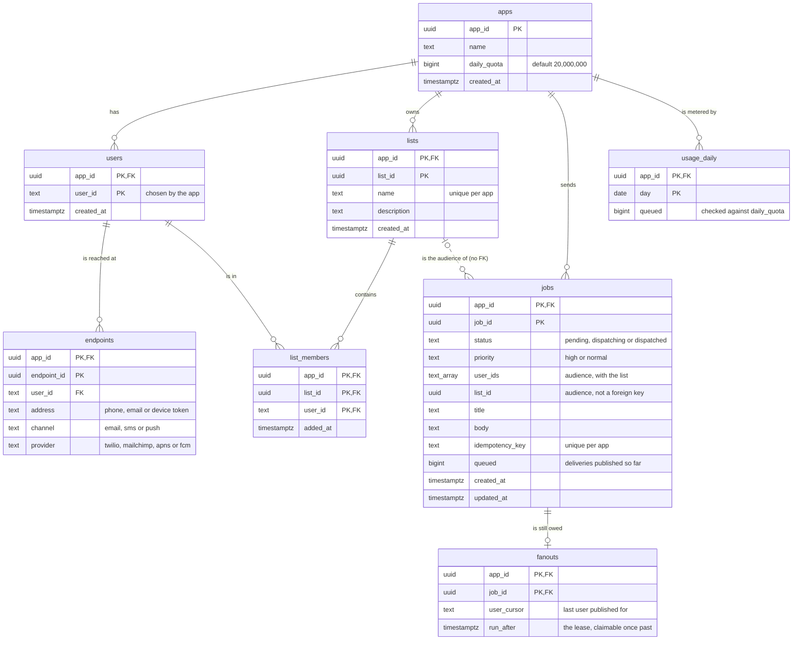

# Entity relationship diagram

Every table of Postgres, from [`api/db/schema.sql`](../../api/db/schema.sql).

## What to notice

- **Everything belongs to an app.** `app_id` leads every primary key, so one app's rows
  sit together and no query can cross apps by accident. Deleting an app cascades to all of it.
- **A job is one row however many people it reaches.** Deliveries are never stored: they
  live in RabbitMQ, and their outcome is counted in Prometheus.
- **`fanouts` is the work queue of the dispatchers.** A row is created with its job and
  deleted when the last delivery is published, so the table holds only jobs in progress.
- **`jobs.list_id` is not a foreign key.** A job keeps its record after its list is deleted.
- **IDs are `uuidv7()`** (Postgres 18), so they sort by creation time. `user_id` is the
  app's own identifier.

## Indexes beyond the keys

| Index | For |
|---|---|
| `endpoints (app_id, user_id) INCLUDE (endpoint_id, channel, provider, address)` | Fan-out reads a page of an audience as one index-only range scan |
| `endpoints UNIQUE (app_id, user_id, channel, address)` | Registering the same endpoint twice does nothing |
| `list_members (app_id, user_id)` | Deleting a user finds its memberships without scanning every list |
| `fanouts (run_after)` | A dispatcher finds the fan-out that has waited longest |
