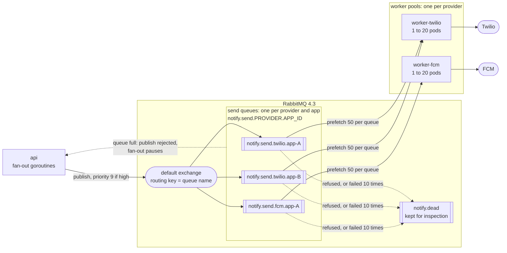
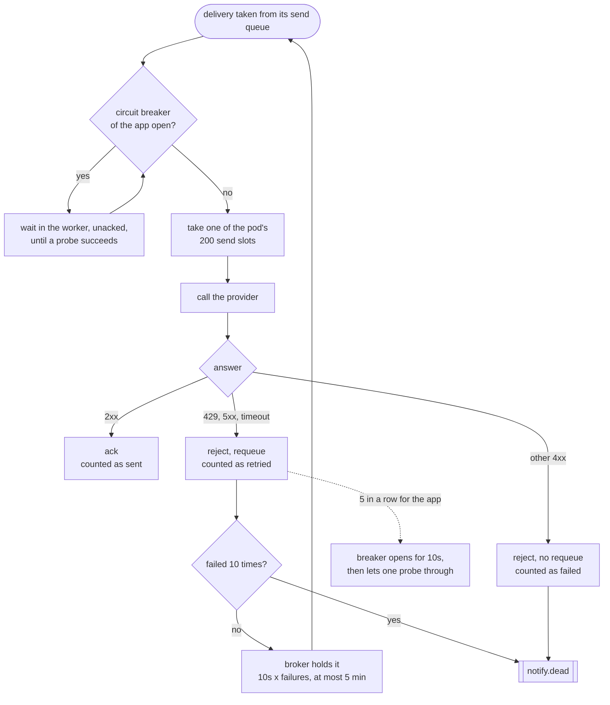

# Queue topology

The RabbitMQ layout, from [`commons/topology`](../../commons/topology/topology.go). Every
queue is a durable quorum queue, and every publish is persistent and confirmed.

## Shape

Only two of the four pools are drawn; `worker-mailchimp` and `worker-apns` are the same.
There is no exchange of our own: a delivery is published straight to its queue by name.
A send queue is declared the first time an app sends through a provider, and workers
look for new queues every 5 seconds.

## What becomes of one delivery

## Decisions

| Decision | How | Why |
|---|---|---|
| One queue per provider **and app** | `notify.send.<provider>.<app_id>` | An app with a huge backlog cannot delay another: each queue is consumed separately. It also gives a backlog per app for free, in RabbitMQ's own metrics |
| One worker pool per provider | Each pool consumes `notify.send.<provider>.*` | A provider that is slow or down holds up only its own pool, and each pool scales on its own queues |
| Fairness between apps | A subscription per queue, each with prefetch 50 | However deep an app's backlog, a worker holds at most 50 of its deliveries, so every app with work waiting gets a share of the 200 send slots |
| Retries belong to the broker | `x-delivery-limit: 10`, delayed retry of 10 s x failures up to 5 min | The worker publishes nothing and keeps no state. A delivery never leaves the broker until it is sent, so a worker that dies loses nothing. Ten failures take about 7.5 minutes |
| Refused is not retried | A 4xx other than 429 is rejected without requeue | It says something about the notification, not about the provider; trying again cannot help |
| Dead deliveries are kept | `x-dead-letter-routing-key: notify.dead`, at-least-once | They can be inspected, and `x-death` says from which queue and why |
| Priority | High deliveries carry AMQP priority 9, normal ones none | Overtaking happens inside one app's queue and never across apps |
| At least once | Ack after the provider answers; stable `message_id` = `job_id:endpoint_id` | A crash between send and ack sends twice. The provider deduplicates on the ID |

## Rate limiting

There is no requests-per-second limiter. Load is bounded at four points instead, each
pushing back on the one before it:

| Where | Limit | What happens past it |
|---|---|---|
| Accepting a job | `apps.daily_quota`, 20,000,000 deliveries a day by default | The API answers 429. Usage lags by a few seconds, so jobs in flight can overshoot |
| A send queue | `x-max-length: 100,000` with `x-overflow: reject-publish` | The broker refuses the publish, the fan-out stops and resumes from its cursor after its 30 s lease |
| A worker | 200 sends at once per pod (`CONCURRENCY`), 50 held per app (`PREFETCH`) | Deliveries wait in their queue, where KEDA sees them and adds pods |
| A failing provider | Circuit breaker per app in each worker: 5 retryable failures in a row | The app's deliveries wait instead of burning their 10 retries, and resume within about 10 s of the provider recovering |
