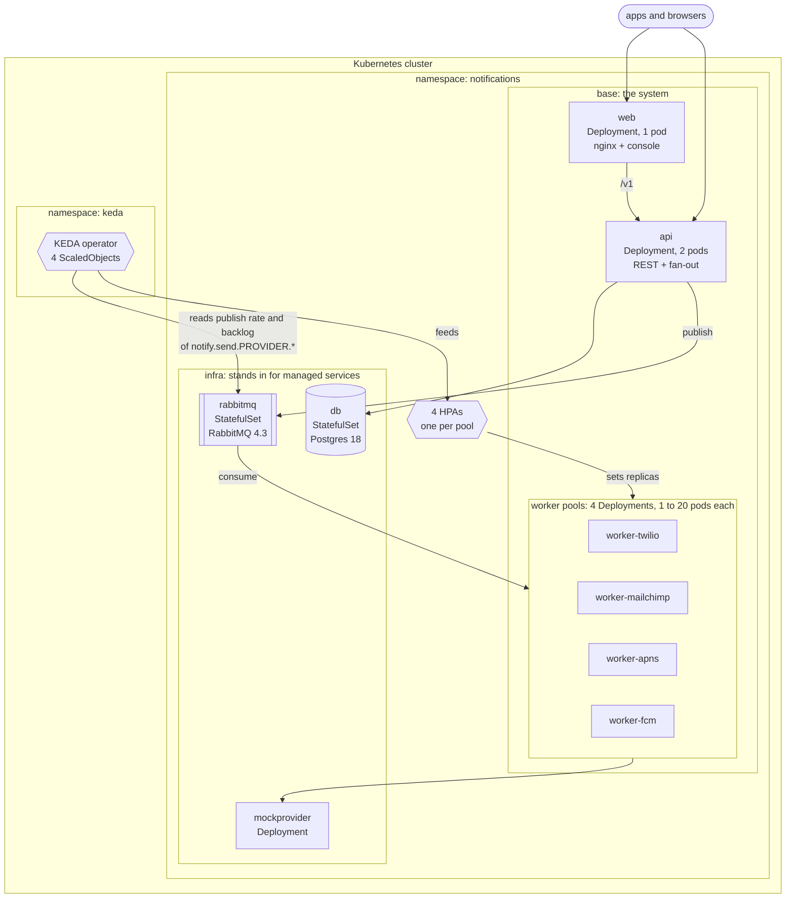
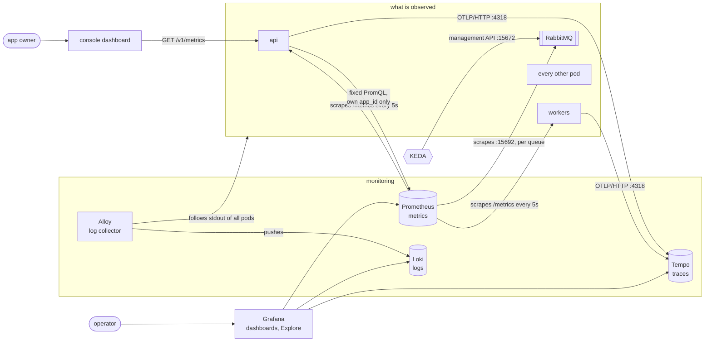

# Kubernetes and observability

What runs on the cluster, from [`deploy/k8s`](../../deploy/k8s), and how it is watched.

## Kubernetes overview

### How the worker pools scale

Each pool has a `ScaledObject` with two triggers on the queues of its own provider. KEDA
scales to whichever asks for more pods.

| Trigger | Target per pod | What it is for |
|---|---|---|
| Publish rate | 300 messages/s | Sizes the pool for the traffic arriving, at 75% of the 400/s a pod can deliver. Holds the pool steady when the queues are empty |
| Queue length | 400 messages | Catches what the rate missed: a burst, or few apps active. One pod-second of backlog per pod adds pods until it drains |

| Setting | `base` | `overlays/k3s` (one node) |
|---|---|---|
| Pods per pool | 1 to 20 | 1 to 6 |
| Wait before giving pods back | 120 s | 30 s |

The minimum is 1, never 0, so the first notification after a quiet spell does not wait
for a pod to start. Only the workers autoscale; the api is fixed at 2 pods.

### How it is put together

| Directory | Holds |
|---|---|
| `base/` | The api, the console, one pool written once and a small directory per provider |
| `infra/` | Postgres, RabbitMQ, the mock provider and the monitoring, one small instance each |
| `overlays/k3s/` | `base` + `infra` for one node: Secrets, image tags, node ports, smaller pods |

A real deployment is another overlay: `base` without `infra`, pointing at managed
services and the real providers.

## Observability stack

Arrows point from whoever starts the call: Prometheus pulls, the services push traces,
Alloy pulls logs and pushes them on.

| Signal | From | Stored in | Seen in |
|---|---|---|---|
| Metrics | `/metrics` of the api and the workers, and RabbitMQ's per-queue metrics | Prometheus | Grafana dashboards, and the console through the API |
| Traces | A `fanout` span in the api, with one `deliver` span per delivery from the workers; the trace context travels in the message headers | Tempo | Grafana Explore |
| Logs | stdout and stderr of every pod | Loki, via Alloy | Grafana Logs dashboard and Explore |

### What to notice

- **Two audiences.** An operator sees every app in Grafana. An app's owner sees only
  their own app in the console: the API runs a fixed set of queries restricted to the
  `app_id` of the token, because Prometheus has no authentication.
- **Metrics are the delivery record.** Nothing flows back from the workers to Postgres.
  What was queued, sent, retried and failed is known per app and provider from
  `notify_fanout_deliveries_total`, `notify_deliveries_total` and RabbitMQ's queue depths.
- **KEDA does not use Prometheus.** It reads RabbitMQ's management API directly, so
  scaling keeps working if the monitoring is down.
- **Nothing is kept.** Prometheus, Tempo and Loki store inside their own pod, and a
  restart empties them.
- **Under compose** the stack is the same, except that Alloy finds containers through
  the Docker socket instead of the Kubernetes API, and Prometheus has a static target list.
