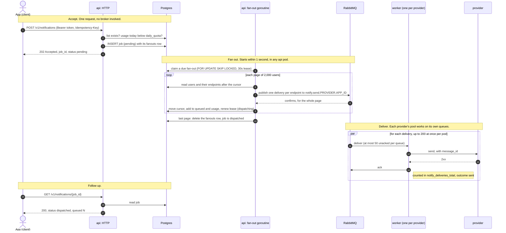

# Sending a notification

The typical case: an app notifies a list, and every delivery succeeds at the first try.

## What to notice

- **202 means stored, not sent.** Accepting a job writes one row and its fan-out, in one
  statement. Nothing is published yet, so the API accepts notifications while RabbitMQ
  is down.
- **Nobody announces the job.** The fan-out goroutines find it by polling `fanouts`, so
  there is no message to lose between accepting and dispatching.
- **Fan-out is resumable.** The cursor is saved after every page. If the pod dies, a
  publish fails or a queue is full, the lease runs out after 30 s and any api pod
  continues from the cursor. The page in progress is published again; `message_id`
  (`job_id:endpoint_id`) is the same, so the provider can drop the copies.
- **`dispatched` is the last status.** It means every delivery is queued, not delivered.
  Workers report nothing back: what was sent or failed is in the metrics, per app and
  provider. See [the observability diagram](03-kubernetes-and-observability.md#observability-stack).
- **The same `Idempotency-Key` twice** returns the job created the first time, without
  creating another.

## When it does not go well

| What happens | Result |
|---|---|
| The app is over its daily quota | 429 at step 2, no job |
| A send queue holds 100,000 deliveries | The publish is rejected, and the fan-out resumes after its lease |
| The provider answers 429 or 5xx, or times out | The worker rejects the delivery, and the broker delivers it again after 10 s x failures |
| The provider refuses the notification (other 4xx), or it has failed 10 times | It goes to `notify.dead` |
| A worker dies holding deliveries | The broker returns them to their queue |

The delivery path in full is in [the queue topology](02-queue-topology.md#what-becomes-of-one-delivery).
